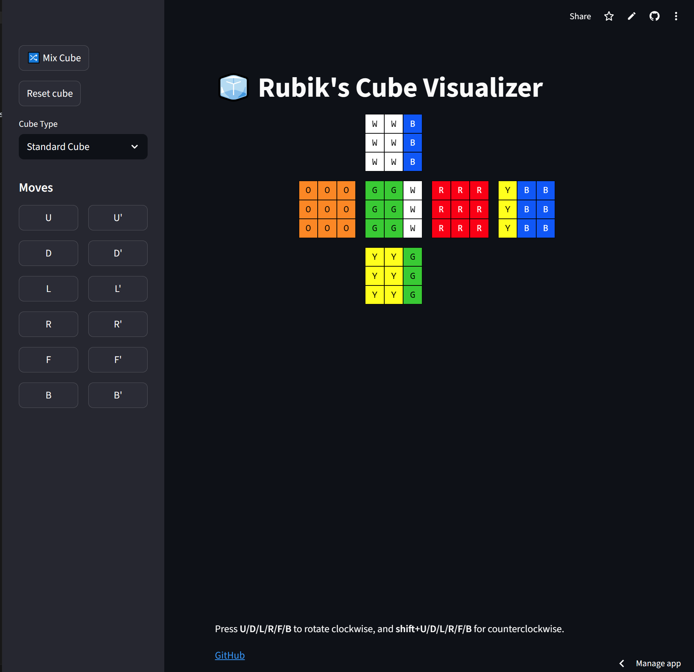

# Rubik's Cube Visualizer



[Run Streamlit version](https://rubiks-42ffmuw4yqimrtjobazgas.streamlit.app/)

## Key files

- cube.py -- core model (no ui) that's shared by multiple interfaces
- flask-app.py -- A UI implemented in flask. Uses templates/index.html.
- streamlit_app.py -- a UI implemented in streamlet. Uses streamlit_shortcuts.py.
- test_cube.py -- some unit tests written in pytest.
- run_tests.py -- A file that adds very little value.
- requirements.txt -- standard Python dependency tracking. Not terribly complete -- need to add streamlit, pytest, and specific version #s.


## Common tasks

- Install the required dependencies:
```bash
pip install -r requirements.txt
```

- Running flask
```
flask --app flask-app.py --debug run
<Navigate your browser to [http://127.0.0.1:5000](http://127.0.0.1:5000)>
```

- Running streamlit
```
streamlit run streamlit_app.py
<Automatically navigates browser to the right page>
```

- Running tests
```
pytest
```
